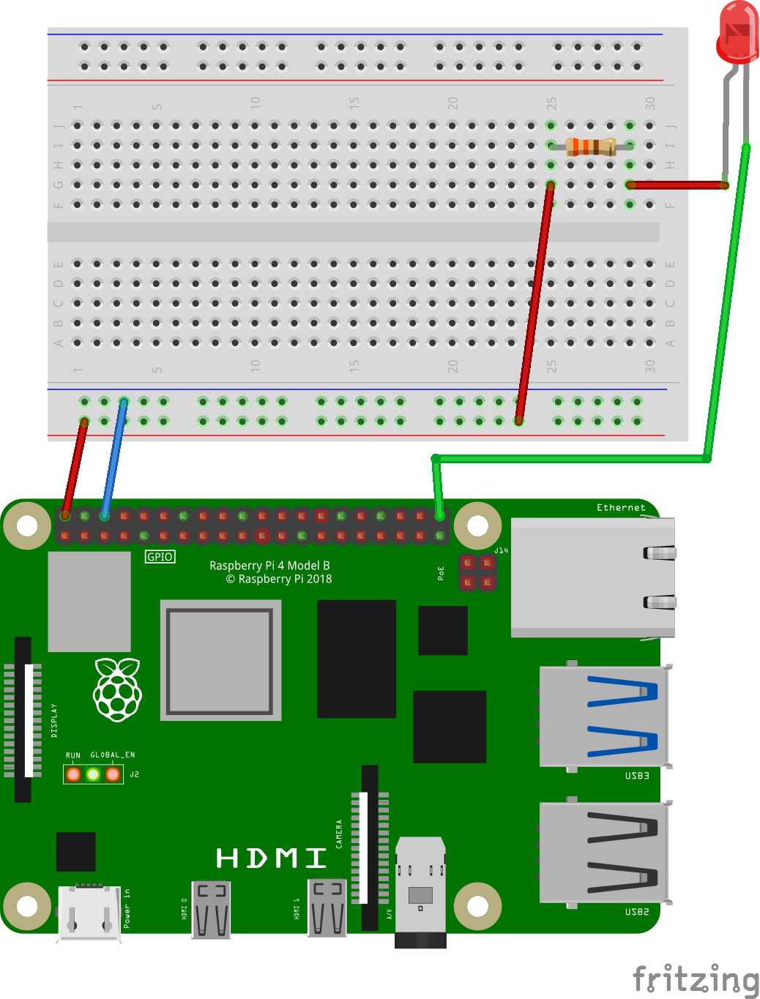
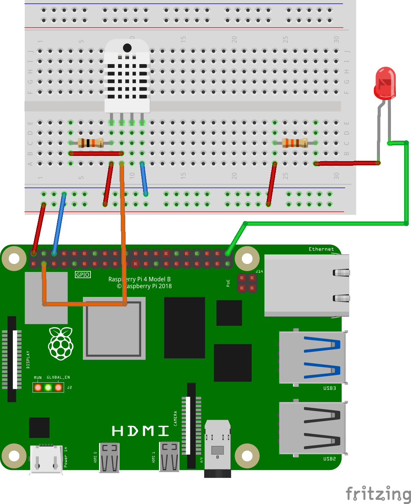

# Raspberry Pi Workshop Instructions

## Introduction

Welcome to the Raspberry Pi Workshop!
Today you will learn how to program a small computer to detect the room's humidity and make a light turn on if the humidity is too high.
There will be a total of 7 tasks for you follow and complete for this workshop.

To perform the tasks, you will be using a Raspberry Pi; one of the smallest and fully featured computers available to hobbyists and professionals alike.

To control the Raspberry Pi you will make use of your previous computer experience and the easy-to-learn programming language Python.

Why Python?
Python has become one of the most popular programming languages in the world in recent years.
It is used in everything from creating Artificial Intelligence (AI) to building websites and connecting smart homes.
It can be used by developers and non-developers alike.

## Task 0: Hello World

Before we begin, I want you to take a look on what you can see in the other document.
You have a section called `List of available commands` where you can see what our software is capable of.
Underneath is a section called `def main()`, this is where we will write all your code for this workshop.

The program that most developers begin with is "Hello World".
In Python, this is a piece of cake!
In the section `def main()` you use the command `print()` to get an output from your program.
Between the parentheses, you write "Hello World" in citation notations.
Now you can execute the program by pressing the `F5` key on your keyboard and see that the Raspberry Pi displays "Hello World" on the screen.

## Task 1: Hello You

One of the best and most useful features of software is that you can change it!
Now change the output from the previous task to greet you with your name(s) instead of greeting the world. When finished, press `F5` to run the code!

## Task 2: Good at counting

The second most powerful feature of software is repition, which makes computers great at counting.
We will build a new section under your `print()` command called a "while loop" in python.
Create a new line under your `print()` and type `while True:` and then enter for a new line.
Great! Everything on this new line will now be repeated, but how do we check if it repeats?
We make the computer print changes over time.

To stop a running program you can press `CTRL + C`.

We have a `count()` command telling the computer to count for us, and we can combine `print()` and `count()` to make the computer tell us how many times it have counted.
On the new line we created, type `print(count())` and then run the code with `F5`.
If you see a number rapidly increasing its value, then you can go to the next task.

## Task 3: Counting seconds

Told you that computers are good at counting, look how fast it goes!
Maybe a bit too fast…
As of now, counting as fast as possible won't be useful for us, let us make the computer count seconds instead so that we can track the time!

First however, we need to tell the computer to stop counting, we can force it to stop by pressing the red square that have appeared in the top middle of the screen, you can also hold down shift and press `F5` to stop the program, or you can ask your guide for help.

How do we make the program count seconds?
The easiest way would be to tell the computer to wait one second between counting.
With python, we can do exactly that!
We can make the program wait by using the `sleep()` command.
Let's add a new line underneath `print(count())` and type `sleep(1)`.
Now our program will display the count, then wait a second, then loop back to count again!

## Task 4: Turn on the light

Now we are going to build a lamp!
Below you will find an image on how to wire the light to the circuit board.
After you have build the lamp, use the `led_on()` command to turn on the LED light in our code.
(The lamp is directional, meaning that the orientation of the lamp matters.
If your lamp doesn't light up, try rotating it)

## Task 5: Make a light show

Good job! You have now successfully connected the LED to the computer.
We can now control it and make a light show. Use the command `led_on()`, `led_off()` and `sleep()` to make the LED light blink.
If you like faster light shows, you can try using `slep(0.5)`.
Or if you like slower ones, try increasing the amount of seconds the computer should wait.

## Task 6: Read the room

Now we are going to connect the humidity and temperature sensor to the computer.
Just like last time, there is an image over the wires below for you to follow.
When assembled, you can get the sensor's readings with `read_sensor_temperature()` and `read_sensor_humidity()`, then we can combine them with `print()` just like we did with the `count()` command!
(The sensor sometimes fails to read the humidity and temperature, it will then report "-1" as an error message. If the sensor reports "-1" for over 5 seconds, then it could be that the sensor is not plugged in correctly)

## Task 7: Sauna detector

Good job! The computer can now read the room and report the temperature and humidity of where the Raspberry Pi is.
We are now going to make the LED lamp light up if either the humidity or temperature is too high. A sauna detector essentially.

Python supports an `if` statement which allows the programmer to ask questions to the system.
A statement like the following asks the program if the temperature in the room is higher than 8 degree Celsius: `if read_sensor_temperature() > 8:`.
This could be used to detect if your fridge door is left open for example.

Now, have the program turn on the LED if the humidity is higher than value X and turn it off if it is lower than value X.
You can choose the value of X as you like.

When you are done, start the program and test it to see if the LED turns on if it gets too humid or too warm.
Unfortunately, we don't have a sauna on campus (yet), so we need to use something else that produces humid warm air for the sensor to read.
How about you?

## Task Bonus: To the great beyond

Congratulations!

You have successfully built a sauna detector!
Now ask your guide what to do, or if you want a final task with a challenge: Make the LED lamp **BLINK** if the room is too humid or warm, instead of only turning the lamp on.
You have learned everything you need to make it happen, I believe in you!

If you are done then you have reached the finish line!
Now ask your guide what to do.
For me, the document, I can't continue further.
So I guess this is goodbye... Goodbye!
